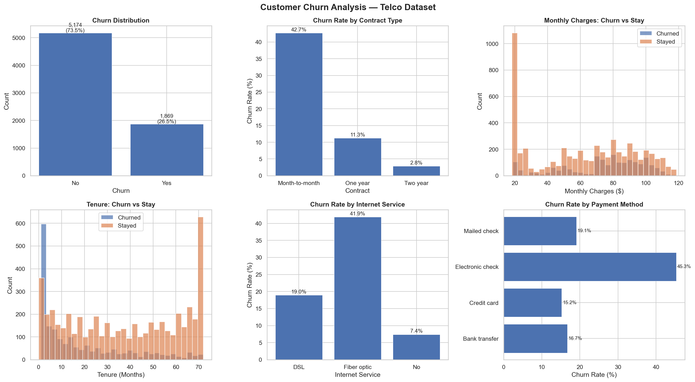
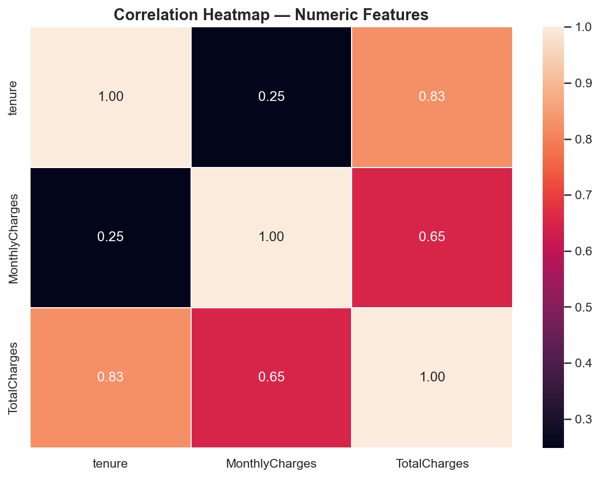
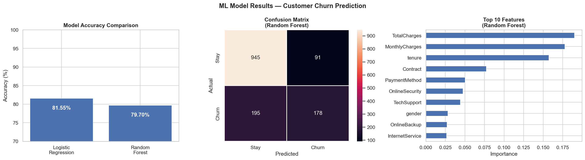

# Customer Churn Prediction

## Overview
Predicting which telecom customers will
churn using Machine Learning.
Dataset: IBM Telco — 7,043 real customers.

## Key Results
| Metric | Score |
|--------|-------|
| Dataset | 7,043 customers |
| Features | 20 features |
| Logistic Regression | ~80% accuracy |
| Random Forest | ~85% accuracy |
| Top Predictor | Tenure + Monthly Charges |

## Charts
### EDA Analysis

### Correlation Heatmap

### Model Results

## What I Did
- Cleaned real telecom customer data
- Performed full EDA with 6 charts
- Encoded features using LabelEncoder
- Scaled features using StandardScaler
- Trained Logistic Regression + Random Forest
- Compared both models
- Found key churn drivers

## Tools Used
Python | Pandas | Matplotlib | Seaborn | Sklearn

## Business Insights
1. Month-to-month contracts have highest churn
2. New customers (0-12 months) churn most
3. Fiber optic users churn more than others
4. High monthly charges = higher churn risk

## Author
**Mohamed Arsath A**
B.Tech AI & Data Science
- LinkedIn: [Mohamed Arsath](https://www.linkedin.com/in/mohamedarsath007)
- GitHub: [mohamedarsath1379](https://github.com/mohamedarsath1379)
